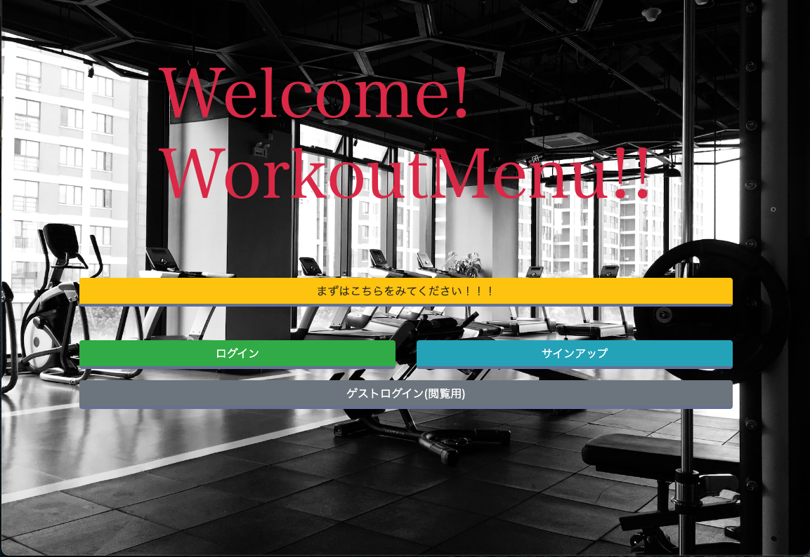

# Workout_Menu

## サイト概要
### サイトテーマ
このサイトは気軽にニックネームで登録でき簡単にメニューが組めてコミュニケーションも取れるサイトです。

### テーマを選んだ理由
以前自分がトレーニングに励んでる時にこの機能があると便利だよなとか、一人でトレーニングしたいけど成果をシェアしたいなとか思ったのでこのテーマにしました。

前職で腰痛持ちの方が多くて辛そうでそのような方を一人でも減らしたいなと思いトレーニングメニュー管理が楽にできるようなサイトを目指しました。

__一日5分〜10分でもいいのでぜひ体幹トレーニングをお勧めしたいです！__

### ターゲットユーザ
- 鍛えるのが好きな方、座りっぱなしの仕事をしている方

- 健康に気をつけている方、将来元気な体のままでいたい方

- 腰痛持ちで筋肉つけたい方、__自分に自信を持ちたい方←自分はこれが理由ではじめました。__

### 主な利用シーン
- 毎日トレーニングする方は勿論、この日時間あるからトレしよって方も思い立った時にスマホで楽々メニュー登録できます。
- 私のように、忘れはしないけど今日は〇〇の日とか気になりすぎて他のことが集中できない方
- 私のように、これやったっけ？とかならない様に完了したトレーニングを一眼で知りたい方
- 別会員どうしでコメントしあったりナイスファイト（いいね！）機能もあってお互いに切磋琢磨してトレーニングを楽しみたい方

## 設計書
- [実装機能リスト](https://docs.google.com/spreadsheets/d/1AUAPTN04nns7Bjc515HlTkGqKKKndizYBcRg9PL4jFA/edit#gid=375590402)

- [テスト仕様書](https://docs.google.com/spreadsheets/d/1zRhu3yCDS8GUBJQqN_yDOFxgC1U5DrMp/edit#gid=1511467858)
- ER図

- [テーブル定義書](https://docs.google.com/spreadsheets/d/1AZk1XgT5Xc2FxfKl6J8KFXE9Ry83AFYarRUiwmbrt5s/edit#gid=1243549839)

- [アプリ詳細設計](https://docs.google.com/spreadsheets/d/1npZOxlI0B2XuQbn5e5en5DpArRS9ojG-gHHTHZBI7sU/edit#gid=549108681)

- UI Flows 会員

- UI Flows 管理者

## 開発環境
- OS：Linux(CentOS)
- 言語：HTML,CSS,JavaScript,Ruby,SQL
- フレームワーク：Ruby on Rails
- JSライブラリ：jQuery
- IDE：Cloud9

## 使用素材
- 写真、画像提供
- [unsplash](https://unsplash.com/ja)
- [O-DAN](https://o-dan.net/ja/)
- [パクタソ](https://www.pakutaso.com/)
- [ロゴ](https://www.designevo.com/)
- [イラスト素材](https://www.ac-illust.com/)
- [storyset](https://storyset.com/)
